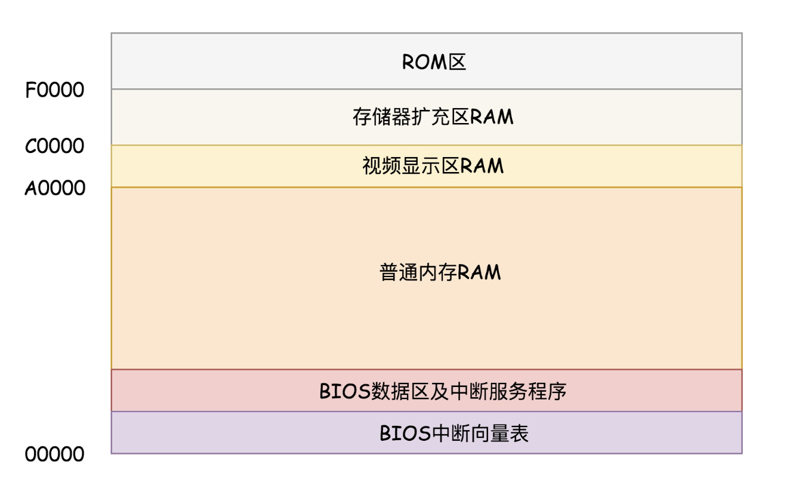
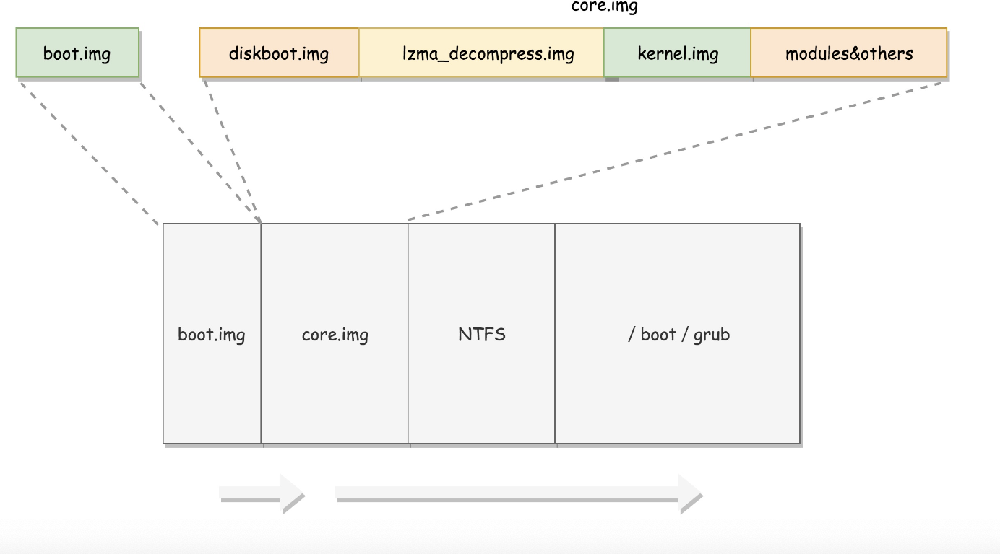

# BIOS到bootloader
```
X86 
    实模式
        寻址空间1M [0,FFFFF]
        每个段最多64KB FFFF
    保护模式
        32 位 寻址 4G[0,FFFFFFFF]
```
## BIOS时期
```
计算机通点,CPU就要开始执行指令

ROM(只读内存),BIOS程序是在这里面的
```
**BIOS时期内存图分布情况**

```
F0000-FFFFF 64K会映射给BIOS程序

电脑加电,寄存器的值会被初始化为 CS 0xFFFF ,IP 0x00

address CS << 4 + IP =0xFFFF0+0X00=0xFFFF0
会正好第一条指令在ROM区域执行


BIOS 会做那些事情
1.会检测硬件是否完好
2.键盘鼠标等设备要进行中断设置(建立中断向量表和中断程序)
  提供  BIOS 等相关操作 设置 等服务
```
## bootloader 时期
```
BIOS 根据默认或设置选择的去选择存储设备启动操作系统(启动盘选项)

识别启动盘根据判断该存储设备是否存在主引导扇区来判断
主引导扇区 0 磁盘 0 磁道 1 扇区 512 bytes ,最后两个是以0xAA55来识别的


主引导扇区存储的内容:
linux grub2 来搞定系统启动


grub2-install /dev/sda 安装启动程序到指定位置

boot.img 由 boot.S(512 bytes)编写


BIOS 结束之前 会选定MBR(主引导扇区)并且把数据加载到内存地址为 0x7C00的位置


boot.S 不会做太多的事情,主要会吧core.img镜像加载到内存(grub2生成的core.img)


core.img 是管理处 
    lzma_decompress.img diskboot.img  kernel.img ....一系列组成
```

```
boot.img 先加载core.img的第一个扇区

core.img的第一个扇区的是diskboot.img(diskboot.S)

加载diskboot.img成功将控制权交给 core.img的 diskboot.img 执行

diskboot.img是任务加载 core.img的其余部分

注意 core.img 是 grub2的内核不是linux的内核


lzma_decompress.img(startup_raw.S):解压kernel.img(kernel.img呗压缩过)

在解压缩 kernel.img 之前需要 调用 real_to_prot 切换到保护模式(实模式的空间只有1M,不能满足内存的需求)
```

## 从实模式切换到保护模式
```
切换到保护模式需要做的工作:

1.启用分段(进程切换)
  创建段描述符

2.启动分页
  管理内存(将内存分成大小相等的块)

3.打开Gate A20 
  打开其他寻址的先

4.real_to_prot 开启保护模式

5.解压 kernel.img ,跳转到 kernel.img上面执行

    kernel.img(startup.S ....一堆c文件)

    startup.S 调用 grub_main(grub_main 是 grub的主函数)

6.grub_main 执行
   6.1 grub_load_config 解析 grub.conf
   
   6.2 grub_cmmand_execute("normal",0,0)
      grub_normal_execute()
      grub_show_menu() 选择启动的操作系统的列表

7.grub_menu_execute_entry()
    选择进入的操纵系统


```