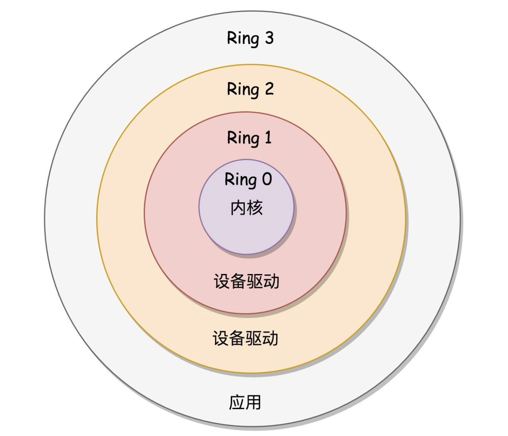

# 内核初始化
[init/main.c内核启动](./init_main.c)
```c
内核启动入口
init/main.c
start_kernel(){
    // 系统创建的第一个进程,我们称之为0号进程
	set_task_stack_end_magic(&init_task);
    // 中断  32 64 等系统调用 
	trap_init();
    // 内存管理模块
	mm_init();
    
    // 调度模块
	/*
	 * Set up the scheduler prior starting any interrupts (such as the
	 * timer interrupt). Full topology setup happens at smp_init()
	 * time - but meanwhile we still have a functioning scheduler.
	 */
	sched_init();
    
    // 初始化基于内存的文件系统rootfs
    vfs_caches_init();// register_filesystem(&rootfs_fs_type)

	/* Do the rest non-__init'ed, we're now alive */
	arch_call_rest_init();
}

底层有很多不用的文件系统,操作系统会把他们抽象成统一对上层提供服务的接口(vfs 虚拟文件系统)

```
## 初始化第一号进程
```c
pid =1 是第一个用户进程
```
#### x86提供的权限分层机制

```
Ring 3 <  Ring 2  < Ring 1 < Ring 0

越在里面权限大小越大
```
## 从内核态到用户态
```c
kernel_init(){

    	if (!try_to_run_init_process("/sbin/init") ||
	    !try_to_run_init_process("/etc/init") ||
	    !try_to_run_init_process("/bin/init") ||
	    !try_to_run_init_process("/bin/sh"))
		return 0;
}

static int try_to_run_init_process(const char *init_filename)
{
	ret = run_init_process(init_filename);
	return ret;
}

static int run_init_process(const char *init_filename)
{
	return kernel_execve(init_filename, argv_init, envp_init);
}
..... do_execve() 执行


```